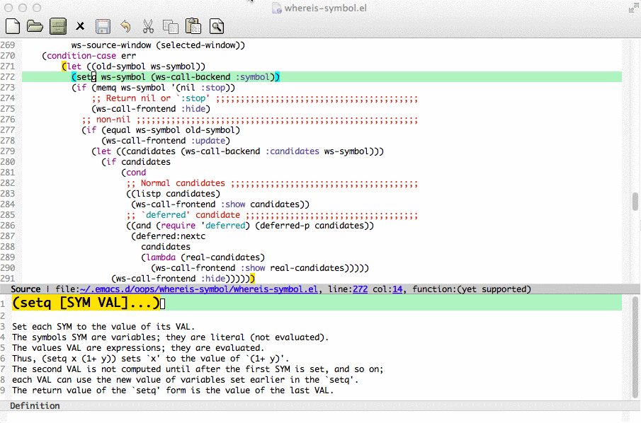
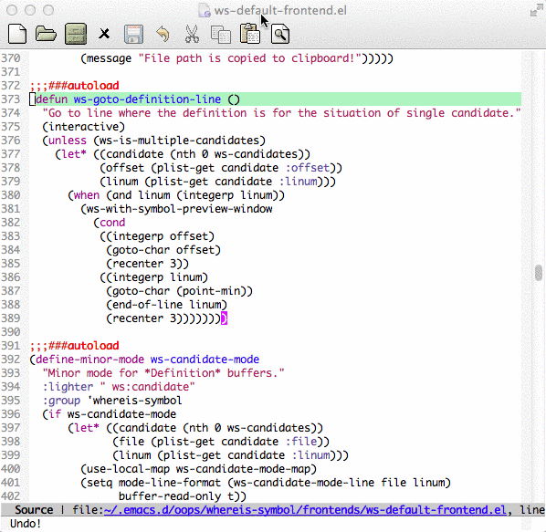

whereis-symbol
==============

What is it? (Constructing ...please wait for pre-release)
-----------
This is a FRAMEWORK which helps you to easily find symbol's definition

Smartly Detect Symbol At Point & Show Definition
------------------------------------------------


Search Local Symbols
--------------------


Usage
-----
Add the following code to your `.emacs` file:
``` lisp
(require 'whereis-symbol)
(whereis-symbol-mode 1)
```

Interactive Function:
* Go to the definition of the symbol if any: `ws-goto-symbol`
* Search local symbols (symbols defined in current file): `ws-search-local-symbol`

Support Languages
-----------------
* Emacs Lisp

TODO
----
* Support C/C++, Python and more.
* Support `Shell` mode.

Contribution
------------
Forks and pull requests are welcome!
